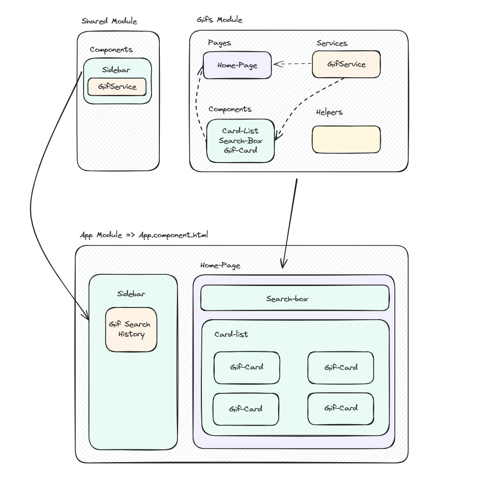

## GifFinder App

### Angular module-based app using Angular 17

* Implements a service to make HTTP calls using the HttpClientModule, to work with reactive programming.

The original idea of this project belongs to Fernando Herrera from DevTalles.

